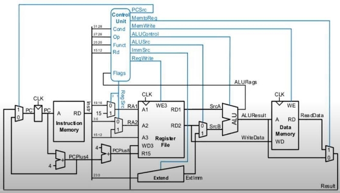



Arquitetura e Organização  

de Computadores 

Arm Thumb  

Alunos: Álvaro Francisco de Oliveira Costa 2013030333              Pedro Henrique R. Goulart 2018014387 

1. **INTRODUÇÃO** 

Como segundo trabalho da disciplina de Arquitetura e Organização de Computadores, foi proposta a implementação (utilizando a linguagem VHDL) e simulação de uma microarquitetura de ciclo única capaz de excetuar o algoritmo Cyclic Redundancy Check de 8 bits. 

Os microprocessadores disponibilizados para a execução do trabalho foram: 

- **ARM Thumb;** 
- Bonfire (Github- RISC V based); 
- DLX (Hennessy & Petterson); 
- IA-32 (Intel); 
- MSP430(Texas Instrumments); 
- PowerPC (IBM); 
- RICV V ( Petterson & Hennesy – Open); 
- SPAR (SUN Microsystems); 
- Z-80 (Zilog); 
- 8051 (Intel); 
- 680x0. 

Foi escolhido como objeto de estudo desse trabalho processador ARM Thumb. 

2. **ARM THUMB** 

ARM, originalmente Acorn RISC Machine, e depois Advanced RISC Machine, é uma família de arquiteturas de 32 bits, com o conjunto de instrução Thumb de 16 bits, possui a característica de  ter  as  principais  execuções  ocorrem  em  um  único  ciclo  de  clock.  Recentemente  os processadores ARM tem conseguido maior destaque devido ao seu baixo consumo energético o que reduz a dissipação de calor permitindo a aplicação em diversas áreas. 
**
` `MICROARQUITETÚRA ARM THUMB (CÍCLO ÚNICO) 

Utilizando a linguagem vhdl foram criados circuitos combinacionais de modo a emular uma microarquitetura  de  ARM  thumb  de  ciclo  único.  Essa  microarquitetura  não  irá  refletir  a capacidade (não possui todas as funções) que um processador ARM possui normalmente, o intuito desse processador é possuir um datapath interligado a uma unidade de controle que consiga executar o código de máquina gerado pelo assembly do arm que traduz o código apresentado no item[ 0.](#_page3_x40.00_y608.52)  

As funções são divididas em 3 grupos sendo eles: 

1) Processamento de Dados: 

2) Processamento de Memória: 

3) Desvio: 

As instruções que o microprocessador será capaz de realizar são: 

- ADD (1); 
- LSL (1); 
- EOR (1); 
- COMP (1); 
- B (3); 
- BLS (3); 
- BLE (3); 
- STR (2); 
- LTR (2). 

A figura 1 traz uma visão geral de como o datapath e a unidade de controle são interligados para possibilitar a execução das instruções. 

Os códigos de cada bloco, o testebench e as imagens das simulações dos elementos estão anexados na pasta principal deste trabalho. 

*Figura 1 -  Representação do Microprocessador* 

3. **CYCLIC REDUNDANCY CHECK** 

A verificação cíclica de redundância (do[ inglês,](https://pt.wikipedia.org/wiki/L%C3%ADngua_inglesa) CRC - Cyclic Redundancy Check) é um método de[ detecção de erros ](https://pt.wikipedia.org/wiki/Detec%C3%A7%C3%A3o_e_corre%C3%A7%C3%A3o_de_erros)normalmente usada em[ redes digitais ](https://pt.wikipedia.org/wiki/Rede_digital)e[ dispositivos de armazenamento ](https://pt.wikipedia.org/wiki/Dispositivo_de_armazenamento)para detectar mudança acidental em cadeias de dados. Mensagens de dados entrando nesses sistemas recebem um pequeno anexo com um valor de verificação baseado no resto de[ divisão polinomial ](https://pt.wikipedia.org/wiki/Divis%C3%A3o_polinomial)do seu conteúdo. No ato da recuperação do dado o cálculo é refeito e comparado com o valor gerado anteriormente. 

CÓDIGO C 

O algoritmo CRC foi implementado primeiramente em linguagem de alto nível, “C”, e o código é apresentado a seguir: 

*#include <stdio.h> int main(){* 

*unsigned int CRC8\_Divisor  = 0b100011101;       //Gerador + 1 (bits) unsigned int CRC8\_Dado     = 0b11000010;        //Polinomio* 

*/\*Algoritmo dde CRC-8\*/* 

*xor = (CRC8\_Dado << 1) ^ CRC8\_Divisor;          //Faz o primeiro deslocamento e exclusivo* 

`    `*for(int j = 0; j < 7; j){* 

`        `*if(xor >= 0b100000000){                     //Verifica se o deslocamento até o bit 9* 

`            `*xor = xor ^ CRC8\_Divisor;               //Caso tem 1 no nono bit faz o exclusivo* 

`        `*}* 

`        `*else{* 

`            `*xor = xor << 1;                         //Desloca o bit em bit* 

`            `*j++;                                    //Contador de controle de "Zeros da extensão 0x00"         }* 

`    `*}* 

*unsigned int transmissor =  (CRC8\_Dado << 8) + (xor ^ CRC8\_Divisor); //Passando polinomio e bits de verificação* 

`    `*return 0;* 

*}* 

CÓDIGO EM ASSEMBLY (ARM THUMB) 

Utilizando o conjunto de instruções disponibilizas (16 bits) para o ARM Thumb, o código em C foi traduzido para o referido assembly e é apresentado a seguir: 

*main:* 

`        `*add     r3, r3, #200 //adiciona o número 200 ao registrador r3* 

`        `*add     r3, r3, #85  //adiciona mais 85 ao registrador r3 (285)*        

`        `*add     r2, r2, #194  //adiciona o número 194 ao registrador r2*        

`    `*add     r1, r1, #0    //adiciona o número 0 ao registrador r1*        

`        `*lsl     r3, r3, #1    //deslocamento à esquerda no conteúdo do r3 em 1* 

`        `*eor     r3, r3, r2    //Xor exclusivo entre r3 e r2, guardando o resultado em r3*     

`        `*b       .L2           // faz um branch para o label L2;*        

*.L4:* 

`        `*cmp     r3, #255     // Compara o valor do conteúdo do registrador r3 com 255 e seta as flags NZCV                   bls     .L3          //Utiliza o resultada das flags NZVC para ir ir ao Label L3 ou não*          

`        `*eor     r3, r3, r2   //Xor exclusivo entre r3 e r2, guardando o resultado em r3*        

`        `*b       .L2          // faz um branch para o label L2;*        

*.L3:* 

`        `*lsl     r3, r3, #1   //deslocamento à esquerda no conteúdo do r3 em 1*         

`        `*add     r1, r1, #1   //Imcrementa o valor de r1 em 1 a cada loop*          

*.L2:* 

`        `*cmp     r1, #6       // Compara o valor do conteúdo do registrador r1 com 6 e seta as flags NZCV*      

`        `*ble     .L4          //Utiliza o resultada das flags NZVC para ir ir ao Label L4 ou não*       

`        `*lsl     r6, r3, #8   //deslocamento à esquerda no conteúdo do r3 em 8 e salva em r6*       

`        `*eor     r3, r3, r2   //Xor exclusivo entre r3 e r2, guardando o resultado em r3*       

`        `*add     r6, r6, r3    //adiciona conteúdo de r6+r3 em r6* 

`        `*add     r0, r0, #0   //adiciona o número 0 ao registrador r0* 

`        `*str     r6, r0  #4  //guarda o valor com os bits de verificação* 

CÓDIGO DE MÁQUINA 

O código assembly foi traduzido em código de máquina e utilizado na memória de instrução do processador de ciclo único, o mesmo é apresentado abaixo:  

1100 1000 0011 0000 1000 0011 1110 0010 0101 0101 0011 0000 1000 0011 1110 0010 1100 0010 0010 0000 1000 0010 1110 0010 1110 0001 1010 0000 0011 00001000 0011 0000 0020 0011 0000 0010 0011 1110 0000 0100 0000 0000 0000 0000 0000 1110 1010 1111 1111 0011 0000 0101 0011 1110 0011 

0011 1000 0000 0000 0000 0000 1001 1010 0000 0010 0011 0000 0010 0011 1110 0000 0100 0000 0000 0000 0000 0000 1110 0000 0100 0000 0000 0000 0000 0000 1110 1010 1110 0001 1010 0000 0011 00001000 0011 0000 0001 0001 0000 1000 0001 1110 0010 0000 0110 0001 0000 0101 0001 1110 0011 0010 1000 0000 0000 0000 0000 1101 1010 1110 0001 1010 0000 0110 01000000 0011 0000 0010 0011 0000 0010 0011 1110 0000 0000 0011 0110 0000 1000 0110 1110 0000 0000 0000 0000 0000 1000 0000 1110 0010 

4. **REFERÊNCIAS**  

S Harris, D Harris - Digital Design and Computer Architecture ARM: Edition – 2016 Elsevier; 

developer.arm.com - Disponível em: [https://developer.arm.com/documentation/ddi0210/c/Introduction/Architecture/The-Thumb- instruction-set ](https://developer.arm.com/documentation/ddi0210/c/Introduction/Architecture/The-Thumb-instruction-set)

[www.keil.com ](http://www.keil.com/)- Disponível em: [https://www.keil.com/support/man/docs/armasm/armasm_dom1361289850509.htm ](https://www.keil.com/support/man/docs/armasm/armasm_dom1361289850509.htm)

https://www.fpga4student.com - Disponível em:[ https://www.fpga4student.com/p/vhdl- project.html ](https://www.fpga4student.com/p/vhdl-project.html)

https://www.embedded.com - Disponível em:  [https://www.embedded.com/introduction-to-arm-thumb/ ](https://www.embedded.com/introduction-to-arm-thumb/)

[https://users.ece.utexas.edu ](https://users.ece.utexas.edu/)- Disponível em: [https://users.ece.utexas.edu/~valvano/EE345M/Arm_EE382N_4.pdf ](https://users.ece.utexas.edu/~valvano/EE345M/Arm_EE382N_4.pdf)

[https://edu.heibai.org ](https://edu.heibai.org/)- Disponível em: [https://edu.heibai.org/ARM%E8%B5%84%E6%96%99/ARM7-TDMI-manual-pt3.pdf ](https://edu.heibai.org/ARM%E8%B5%84%E6%96%99/ARM7-TDMI-manual-pt3.pdf)

[https://azeria-labs.com ](https://azeria-labs.com/)- Disponível em:[ https://azeria-labs.com/azm/ ](https://azeria-labs.com/azm/) 
